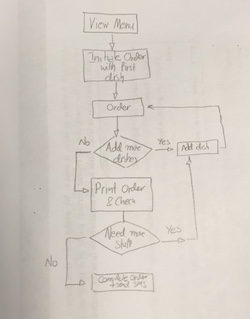

[](http://forthebadge.com) [](http://forthebadge.com)

Takeaway Challenge
==================
```
                            _________
              r==           |       |
           _  //            |  M.A. |   ))))
          |_)//(''''':      |       |
            //  \_____:_____.-------D     )))))
           //   | ===  |   /        \
       .:'//.   \ \=|   \ /  .:'':./    )))))
      :' // ':   \ \ ''..'--:'-.. ':
      '. '' .'    \:.....:--'.-'' .'
       ':..:'                ':..:'

 ```
## Challenge description

 Write a Takeaway program with the following user stories:

 ```
 As a customer
 So that I can check if I want to order something
 I would like to see a list of dishes with prices
```
```
 As a customer
 So that I can order the meal I want
 I would like to be able to select some number of several available dishes
```
```
 As a customer
 So that I can verify that my order is correct
 I would like to check that the total I have been given matches the sum of the various dishes in my order
```
```
 As a customer
 So that I am reassured that my order will be delivered on time
 I would like to receive a text such as "Thank you! Your order was placed and will be delivered before 18:52" after I have ordered
 ```
 ## How to use this depository
 First you need to clone the depository on your local machine. To do so, please open your favourite CLI and use the following commands:

 ```
 git clone git@github.com:lunaticnick/makersacademy-mcw02-takeaway-challenge.git local_directory_name
 cd local_directory_name
 ```

 Then in order to play the game you will need to use interactive Ruby (IRB). If you do not have Ruby and IRB installed on your computer, please click [here](https://www.ruby-lang.org/en/documentation/quickstart/) for instruction.

 After you have installed Ruby and IRB, open your favourite Command Line Terminal and ensure that you have the pre-requisites for the app to work. In more deatil, the app requires the Twilio RubyGem [[more info](https://github.com/twilio/twilio-ruby)]

 All prerequisites can be installed using bundler by running the command ```$ bundle```. If you don't have bundler already installed, please run ```$ gem install bundle``` if you don't have bundle already installed.

 ---

 ### How I approached & solved this Challenge
 1. Read user stories and start generating a flow Diagram
 2. Start creating the required Classes, so that we can adhere Single Responsibility Principle
 3. Prior to writing any code, stat writing the unit test as per user stories
 4. Ensure that the simplest code, to pass the test is written and refactor
 5. Move to the next unit testing
 6. Whenever a new Class is generated, when moving functionality from one Class to another refactor

---
### How to order Take Away

Create a new order and view a list of menu items with prices:

```
takeaway_directory$ irb
2.4.2 :001 > require "./lib/takeaway"
 => true

2.4.2 :002 > takeaway = TakeAway.new
 => #<TakeAway:0x00007fa0da1cdd10 @menu=#<Menu:0x00007fa0da1cdc98 @dishes={:Chicken=>3.78, :Pasta=>4.59, :Salad=>2.86}>>

2.4.2 :003 > takeaway.view_menu
  => "Chicken £3.78 | Pasta £4.59 | Salad £2.86"
```

Throw a warning if you try viewing your order but have not ordered anything
```
2.4.2 :004 > takeaway.view_order
RuntimeError: You have not ordered anything yet!
```

Add menu items to the order and view total:
```
2.4.2 :005 > takeaway.create_order("Pasta", 4.59)
 => [{"Pasta"=>4.59}]

2.4.2 :006 > takeaway.add_more_dishes("Pasta", 4.59)
 => [{"Pasta"=>4.59}, {"Pasta"=>4.59}]

2.4.2 :007 > takeaway.add_more_dishes("Chicken", 4.59)
 => [{"Pasta"=>4.59}, {"Pasta"=>4.59}, {"Chicken"=>4.59}]

2.4.2 :008 > takeaway.print_current_order
"Pasta - 4.59"
"Pasta - 4.59"
"Chicken - 4.59"
"Total = 13.77"
 => "Total = 13.77"
```

Send confirmation text to customer once order complete:
```
2.4.2 :014 > takeaway.complete_order
"Message sent to end customer. Your order will be delivered at 12:47 AM"
 => "Message sent to end customer. Your order will be delivered at 12:47 AM"
```

### Related Files
* **menu.rb** : includes the list of dishes
* **takeaway.rb** : is the front-end file of the program
* **order.rb** : handles all aspects of the order generation process
* **message.rb** : handles the notification sms generation and delivery
* **secret_data.rb** : stores the Twilio account and auth tokens (not uploaded to github for security reasons)

---

### Flow Diagram


---

### Further Work
* Improve so that list of dishes can be loaded from CSV
* Create an interactive front-end
* Add a delete method for dishes
* Use stubs & doubles for testing (at the moment, a dummy return has been created with the **message.rb**)
* Investigate more edge cases (e.g. dish requested not existing)
* Add a method to be able to correct errors in total cost of order.
